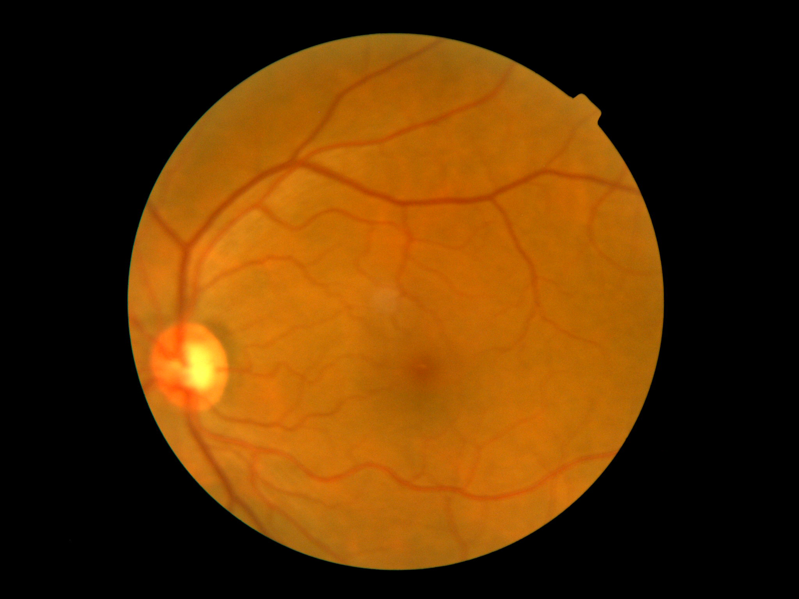
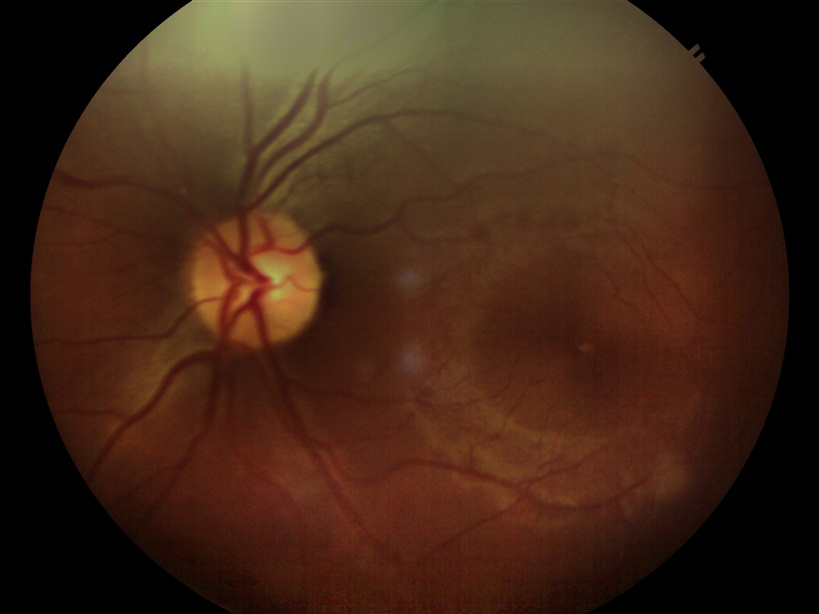
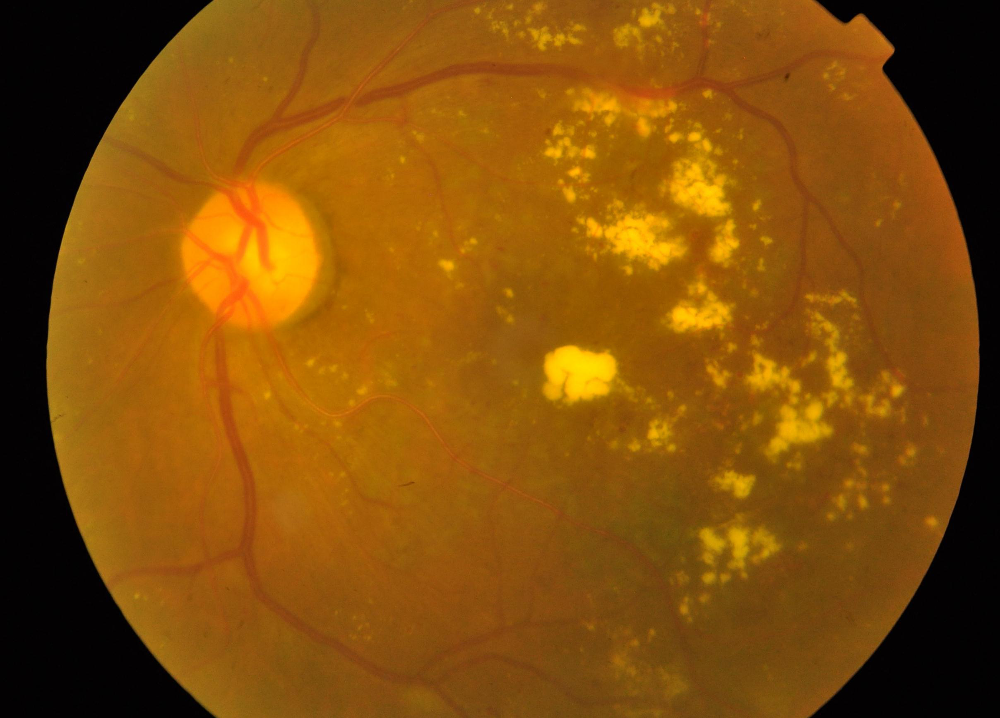

# retinAI

**retinAI** is a deep learning-based system for the early detection of diabetic retinopathy using retinal fundus images. It uses Convolutional Neural Networks (CNNs) for classification and employs Grad-CAM for model interpretability.

## Features

- Trains a CNN on retinal image data (e.g. APTOS/Kaggle DR dataset)
- Visualizes model attention using Grad-CAM for explainability
- Built using PyTorch and OpenCV

## Getting Started

Clone this repository and run `retinAI_notebook.ipynb` to train and test the model.

## Train Images

